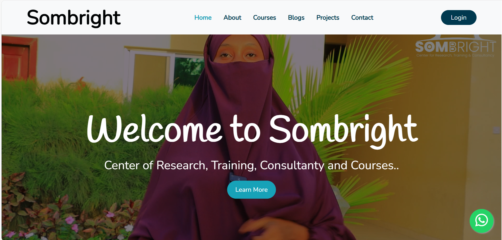

# Full Stack Web Development Course

### Instructor: [Mohamed Yonis Yusuf]
_Last Year IT Student at [Salaam Univerity] | Full Stack Developer | Coding Challenge Winner_

---

## Slide 1: **Introduction**

**Welcome to the Full Stack Web Development Course!**

- I am [Mohamed Yonis Yusuf], a Full Stack Developer with hands-on experience in web technologies.
- Self thought developer at online learning.
- Completed my Full Stack Development certification from Irise Academy in 2023.
- Participated and won **Radmaan Coding Challenge 2023**.
- Part of the winning team at the **Mogadishu Tech Summit Hackathon 2024**.
- Developed websites such as **SomBright**, a platform offering research, training, and consultancy services.
  

---

## Slide 2: **What is Full Stack Web Development?**

- Full Stack Development involves working on both **Front-end (client side)** and **Back-end (server side)** of web applications.
- **Front-end:** Building the user interface (UI) using HTML, CSS, and JavaScript.
- **Back-end:** Server-side logic, database management, and APIs.
  
> **Image:**  

---

## Slide 3: **Technologies Covered**

- **Front-end:** 
  - **HTML**: Structuring content.
  - **CSS**: Styling and responsive designs.
  - **JavaScript & React**: Interactivity and dynamic content.
  
- **Back-end:** 
  - **Node.js  & Express.js**: Server-side logic and routing.
  - **Databases**: MongoDB, MySQL for data storage and management.
  
> **Image:** 

---

## Slide 4: **Course Structure**

1. **Weeks 1-8**: Introduction to Front-end Development (HTML, CSS, Tailwind css, JavaScript).
2. **Weeks 8-12**: javascript Framework (Reactjs).
3. **Weeks 12-15**: Backend (Nodejs, expressjs and MongoDB).
4. **Final Project**: Building a real-world full stack web app.

---

## Slide 5: **Learning Outcomes**

By the end of this course, you will:
- **Master Full Stack Development**: Build both client and server sides of applications.
- **Create Dynamic Websites**: Use React to create interactive, responsive UIs.
- **Deploy Applications**: Learn how to host apps on platforms like Vercel
  
> **Some Example of projects we gonna develope::** 

---

## Slide 6: **Career Opportunities**

- **Full Stack Developer**
- **Front-end/Back-end Developer**
- **Web Application Developer**
- **Freelance Developer**

Full Stack Developers are in high demand, and mastering both front-end and back-end skills opens a wide range of career opportunities in tech.

> **Full stack in market demand:** 

---

## Slide 7: **My Experience**

I have:
- Developed **SomBright**, a website offering research, training, and consultancy services.
- Won the **Radmaan Coding Challenge 2023** and participated in the **Mogadishu Tech Summit Hackathon 2024**.
- Overcame challenges and continuously honed my skills in both **self-taught** and **formal learning** environments.

> **Images:** 
>> **Sombright Website:** 
---
>> **Ramadaan Coding Challenge** 
---
>> **Mogadisho Tech Submit Hackathon** 
---

## Slide 8: **Resources and Tools**

- **Learning Resources:**
  - w3schools.com
  - freeCodeCamp
  - Stack Overflow
  
- **Tools:** 
  - Git & GitHub for version control.
  - Figma for UI design.

> **Git And GitHub:**
>>  

> **Figma:**
>>  

---
---

## Slide 9: **Q&A**

**Any Questions?**
Feel free to ask anything about the course or topics you'd like to explore further!

---

## Slide 10: **Conclusion**

- **Stay Motivated and Committed**: Learning web development takes time and practice, but the rewards are worth it.
- **Build a Portfolio**: Every project you work on will contribute to your portfolio, which will be crucial for your career.
  
> **Image:** 

---
# The History of HTML

## Introduction
HTML (HyperText Markup Language) is the standard language used to create web pages. It provides the structure for the content displayed on the web, using various tags and elements to format and organize text, images, and links.

---

## The Beginning

### 1989 - The Birth of HTML
HTML was created by **Tim Berners-Lee** in 1989 while working at **CERN** (the European Organization for Nuclear Research). He wanted to create a system that would allow researchers to share documents across different computers. This led to the development of the **World Wide Web**.

- **Key Events**:
  - In 1989, Tim Berners-Lee wrote the first proposal for the **World Wide Web**.
  - In 1991, he published a document called **"HTML Tags,"** which included 18 elements that were the first version of HTML.

> 
> *Tim Berners-Lee - The inventor of HTML*

### 1993 - HTML Grows
HTML gained popularity quickly. In 1993, the first official documentation of HTML, **HTML 1.0**, was published. During this time, web browsers were created to display HTML content, including **Mosaic**, the first web browser that popularized the web.

- **1993**: HTML 1.0 published.
- **1994**: The **World Wide Web Consortium (W3C)** was founded by Tim Berners-Lee to develop web standards, including HTML.

---

## Evolution of HTML Versions

### HTML 2.0 (1995)
In 1995, HTML 2.0 was introduced. This version standardized the features from HTML 1.0 and added more capabilities, allowing for more complex web designs.

### HTML 3.2 (1997)
HTML 3.2, introduced by the W3C, expanded the language with new features such as support for tables, applets, and text formatting elements.

### HTML 4.0 (1999)
HTML 4.0 was a major update that added support for **stylesheets**, enabling designers to separate the presentation of web pages from the structure. It also improved accessibility features.

### HTML5 (2014)
HTML5, introduced in 2014, is the latest major version of HTML. It added support for new multimedia elements, like `<audio>` and `<video>`, and improved web applications with features like **local storage**, **geolocation**, and **responsive design**.

> 
> *HTML5 Logo*

- **Key Features**:
  - Semantic tags like `<header>`, `<footer>`, and `<article>`.
  - Multimedia elements: `<audio>`, `<video>`.
  - Offline capabilities: local storage.
  - Canvas and SVG for 2D and 3D graphics.
  
---

## Conclusion
From its humble beginnings in 1989 to the powerful HTML5 we use today, HTML has revolutionized how we access and share information on the web. It continues to evolve as web standards and technologies advance, shaping the future of the digital world.

---
# BEFORE WE START OUR PERIOD WE HAVE TO SELECT CLASS MONITOR
### Selecting a class monitor
> 
---
# Preparing our eviromnent 
## installing necessary packages.
### VS CODE
>> 
### LIVE SERVER
>> 
---
# LET'S GET START WITH HTML  BASIC SYNTAX

##### CRUD CREATE READ UPDATE AND DELETE 

